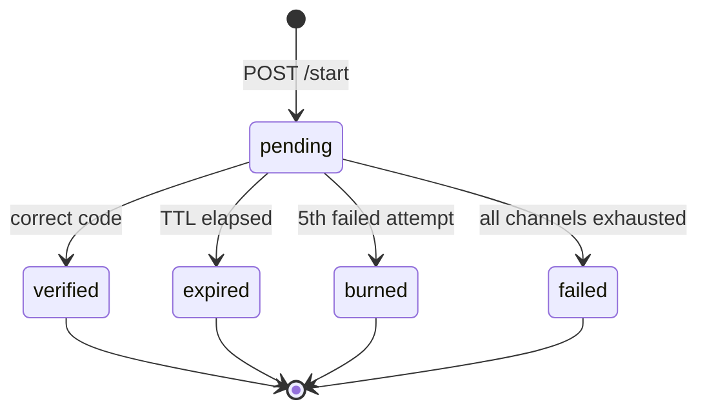

# otp-router

A provider-independent OTP verification router with automatic cross-channel fallback.

A company integrates two REST endpoints — `POST /v1/verification/start`,
`POST /v1/verification/check`. Underneath, the router picks the channel most likely to
actually get a code into the user's hands (not just delivered — verified), falls back to
another channel automatically when it doesn't, and learns per-number which channel works
from every attempt it makes. It sits above providers rather than being one: WhatsApp
direct to Meta at Meta's rate, Indian SMS through a domestic provider, international SMS
through Twilio, all behind one contract that never changes for the customer.

What's actually differentiated from "WhatsApp-first with SMS fallback" (Twilio Verify
already does that): outcome-scored routing rather than an if-else chain, a decision log
that explains every skip rather than a black box, and a routing policy an account can
edit through the API with no deploy. See `PROJECT.md` for the full framing,
`ARCHITECTURE.md` for system structure, and `REQUIREMENTS.md` for what's actually tested.

## Architecture

```
                    ┌─────────────────────────────────────────┐
   customer  ──────▶│  apps/api  (Fastify)                    │
   POST /start      │  auth → validate → rate limit → route   │
   POST /check      │  → persist → enqueue → 202               │
                    └──────────────┬──────────────────────────┘
                                   │ enqueue
                          ┌────────▼────────┐
                          │  Redis / BullMQ │
                          └────────┬────────┘
                                   │ consume
                    ┌──────────────▼──────────────────────────┐
                    │  apps/worker                             │
                    │  delivery · fallback-timer ·             │
                    │  webhook-ingest · score-recompute        │
                    └──────┬───────────────────────┬───────────┘
                           │ send                   │ read/write
                    ┌──────▼───────┐        ┌──────▼──────┐
                    │  providers   │        │  Postgres   │
                    │  meta·twilio·│        └─────────────┘
                    │  simulated   │
                    └──────▲───────┘
                           │ status webhooks
                    ┌──────┴──────────────────────┐
                    │  apps/api /webhooks/:prov    │
                    │  verify sig → dedupe → 200   │
                    └──────────────────────────────┘
```

Three processes: **api**, **worker**, and the **dashboard** static bundle. Postgres and
Redis are managed services. The API never calls a provider synchronously — that single
rule is what makes the sub-100ms `/start` response (`R1.1.5`) achievable and testable
(full diagram and package boundaries: `ARCHITECTURE.md` §1–2).

## Fallback timeout reasoning

Every channel in a verification's chain gets a fixed timeout, scheduled the moment that
channel's send is confirmed (`R4.2` — at send time, not at `/start` time, since there's
nothing to time out until a send has actually happened):

| Channel  | Timeout |
| -------- | ------- |
| WhatsApp | 20s     |
| SMS      | 30s     |

**Why these numbers, not something else.** Waiting for a WhatsApp read receipt means
waiting forever — plenty of people leave a chat unread for hours. So the timeout has to
be judged against _when the user acts_, not when they _see_ the message, and most users
who are going to enter a code at all do it within about 15 seconds of it arriving.

That gives a window: below roughly 15s, the fallback fires while a normal, attentive
user is still mid-read — every one of those verifications now gets sent twice, on two
channels, and pays for both. Above roughly 30s, a user who hasn't acted by then has
usually already given up and closed the tab; firing a fallback at that point buys
nothing but cost. 20–30s is the balance point: late enough that a normal user's
in-progress action isn't second-guessed, early enough that a genuinely stuck delivery
gets a second channel before the user abandons the flow. SMS gets the longer end of that
window because carrier-side SMS latency is itself more variable than a WhatsApp Cloud
API send, so a SMS-is-the-fallback path needs more slack before its own timer would fire
in turn.

These are fixed constants for now (`packages/core/src/fallback/channel-chain.ts`,
`CHANNEL_TIMEOUT_MS`) applied identically to every account. `R4.5` calls for this to
come from each account's routing policy instead — Phase 5's job. Until then, every
account gets the same reasoning applied to it, which is at least a defensible default
rather than an arbitrary one.

**What actually enforces this, not just the number.** The timeout value is only half the
story — the other half is that firing it must be safe to get wrong twice:

- **The fallback timer is not the only way a channel resolves.** A `delivered` or
  `delivery-failed` webhook can resolve the same attempt first. Both paths — the webhook
  processor and the timer processor — write through the same atomic conditional UPDATE
  (`WHERE status = 'sent'`), so whichever reaches Postgres first wins the row, and the
  other one's UPDATE matches zero rows. That's the entire mechanism behind "a timer
  firing against a terminal verification is a no-op returning success, not an error"
  (`R4.3`/I9) — there's no separate cancellation state to get out of sync, just one
  guard that every writer already goes through.
- **Cancellation on success is best-effort, deliberately.** When `/check` succeeds, the
  API tries to remove every pending fallback-timer job for that verification
  (`queue.remove(jobId)`). If that removal is missed — a race, a crash, whatever — the
  timer still fires later, hits the same conditional UPDATE, finds the attempt already
  resolved, and no-ops. The correctness guarantee never depends on the cancellation
  actually landing.
- **The code is never regenerated across the chain (`R2.3`).** Every channel in the
  chain sends the exact same code, decrypted from `verifications.code_encrypted`
  (AES-256-GCM, distinct key from every other secret in the system) at the moment a
  fallback advances. This is what makes "late delivery after fallback fired still
  verifies" (T5) true by construction: `/check` only ever looks at the verification row,
  never at which channel's delivery attempt is in what state.

## State machine

Committed to `docs/state-machine.md` before lifecycle code was written, per PLAN.md
Phase 0 — every ambiguity resolved on paper first.



`pending` is the only non-terminal state. Every transition is a single atomic
conditional `UPDATE ... WHERE status = 'pending'`, checked by affected row count — zero
rows means someone else already won the race, and the response is the current state,
never a retry or an error. A late event (a delayed webhook, a fallback timer firing
after success) arriving against a terminal verification is a no-op that returns `200`
(I9). Full rules and rationale: `docs/state-machine.md`.

## Phase 4 — real provider contract and webhooks

Reduced scope per `PROJECT.md`'s hard constraints: a test WABA can't create the
authentication templates a real OTP send needs, so `MetaProvider` is written against the
real Cloud API contract and proven with a live `hello_world` send, but
`SimulatedProvider` remains the primary delivery path (`R5.3`). Twilio, authentication
templates, and production WABA setup are all skipped entirely.

**Signature verification runs before any parsing or database work.**
`POST /v1/webhooks/meta` verifies `X-Hub-Signature-256` inside a Fastify content-type
parser scoped to just that route — it runs on the raw request bytes before Fastify's
JSON parser, Zod validation, or the route handler ever see the body. An invalid
signature calls back with an error carrying `statusCode: 401` and the request never
reaches the handler, the ingest queue, or Postgres (T11). Ordering is the actual
security property here, not just the presence of an HMAC check: verifying a signature
_after_ parsing means an attacker's malformed-but-unsigned JSON has already been
deserialized by the time you reject it.

**Dedupe is a database unique constraint, not application bookkeeping.**
`webhook_events` is keyed on `(provider, provider_message_id)` alone (not event type) —
the first event a message receives is the one stored and acted on; any later event for
that same message, regardless of type, is a duplicate at the DB level (`R6.2`). A late
`delivered` arriving after a `failed` already resolved the attempt (`R4.8`) is the
canonical case this covers.

**Cost is frozen onto the attempt at send time, not looked up later (`G8`).**
`provider_rates` holds Meta's WhatsApp authentication rate card — ₹0.115 India domestic,
₹2.00 international (midpoint of the ₹1.75–2.50 band), effective 1 July 2026 — plus
representative SMS placeholders. `cost_micros_at_send` is written once, at send time,
so a later rate-card update never rewrites a historical attempt's cost. Seed it with
`pnpm --filter @otp-router/api seed:rates`.

**Local webhook delivery.** Meta needs a public HTTPS URL to call back. Run:

```
cloudflared tunnel --url http://localhost:3000
```

and register the printed `https://*.trycloudflare.com/v1/webhooks/meta` URL (plus
`META_WEBHOOK_VERIFY_TOKEN`) in the Meta app dashboard's webhook subscription.

**Live proof.** With `META_PHONE_NUMBER_ID`, `META_ACCESS_TOKEN`, and
`META_APP_SECRET` set, `MetaProvider` sends a real `hello_world` template — the
recorded demo artifact proving the adapter talks to the actual Cloud API, not just its
documented shape.

## Simulation results

`pnpm simulate --scenario=india-mixed --seed=42` drives the **real** routing engine
(`R9.2`) through a seeded synthetic population and virtual clock — no wall-clock
sleeping, no reimplemented routing logic. `--ab` compares outcome-scored routing against
a fixed, non-adaptive channel order on identical traffic. Presets: `india-mixed`,
`whatsapp-degraded`, `cold-start`, `international` (`packages/simulator/scenarios/`).

**Method.** All numbers below are from `pnpm simulate --scenario=india-mixed --seed=42
--ab [--fixed-chain=<chain>]`, 10,000 simulated verifications, reproducible with that
exact command and seed. Cost is `provider_rates` INR at send time (`G8`); "verified"
means a correct `/check` within TTL, not a delivery webhook (`G1`).

| Metric (india-mixed, seed 42) | Outcome-scored | Fixed whatsapp→sms | Fixed sms-only |
| ----------------------------- | -------------: | -----------------: | -------------: |
| Verification rate             |         93.34% |             92.94% |         88.73% |
| Fallback rate                 |         11.20% |             38.46% |          0.00% |
| p50 time-to-verify            |        7,996ms |            9,289ms |        7,688ms |
| p95 time-to-verify            |       27,539ms |           37,234ms |       23,528ms |
| Cost per verified (₹)         |         0.1708 |             0.1808 |         0.1658 |

Read against the fixed WhatsApp-first chain, outcome-scored routing is **~6% cheaper**
per successful verification and has a **27pp lower fallback rate**, at effectively the
same verification rate (**-0.4pp**, a wash). Read against SMS-only, outcome-scored
routing is **4.6pp more successful** but **~3% more expensive** per success — it spends
more because it tries the (here, cheaper) WhatsApp channel first and sometimes pays for
a wasted attempt before falling back, but that spend buys more completed verifications.

**Model limitation: SMS has no reachability gate.** The synthetic population
(`packages/simulator/src/population.ts`) models WhatsApp reachability explicitly
(`whatsappReachableShare`) but treats SMS as reaching 100% of numbers — the reduced-scope
assumption this project makes about SMS (`PROJECT.md`). That is why routing order barely
moves verification rate against the fixed WhatsApp-first chain above: in this model, SMS
as a fallback essentially never fails to reach someone once tried, so there is no
scenario in which routing order determines whether a verification succeeds at all, only
how fast and how expensively it does. **The cost finding above is conditional on that
assumption**: under this model, pure verification-rate optimization would shift traffic
toward SMS even though it is the more expensive channel here, purely because SMS never
fails to reach a number — a real SMS failure mode (carrier filtering, DND registry
rejection, DLT template mismatches) would very likely make routing order affect
verification rate too, not just cost and speed. That mechanism doesn't exist in this
simulator today; the fix is adding it to the model, not tuning scenario parameters to
manufacture a bigger delta on the model as it stands.

## SDK

`packages/sdk` is a typed client over the two customer-facing endpoints (`G9`):

```ts
import { OtpRouterClient } from "@otp-router/sdk";

const client = new OtpRouterClient({ apiKey: "sk_live_...", baseUrl: "https://api.example.com" });

// Idempotency-Key is auto-generated with crypto.randomUUID() when omitted (R1.1.6) —
// a retried network call replays the original send instead of queuing a second one.
const { verification_id } = await client.start({ phone_number: "+919876543210" });

const result = await client.check({ verification_id, code: "123456" });
// or poll instead of prompting the user for a code synchronously:
const final = await client.waitForResult(verification_id, { intervalMs: 2000, timeoutMs: 60_000 });
```

## Out of scope

Articulated scoping reads as maturity; unexplained gaps read as abandonment.

| Excluded                                   | Reason                                                                                                                                                                                                                                                                                                |
| ------------------------------------------ | ----------------------------------------------------------------------------------------------------------------------------------------------------------------------------------------------------------------------------------------------------------------------------------------------------- |
| **Ads or promotional content in messages** | Structurally impossible. WhatsApp authentication templates use a preset format with no URLs, media, or emojis, and only authentication templates may carry a passcode. Mixing promotional content risks reclassification of every template on the account. Indian SMS is blocked equivalently by DLT. |
| Voice OTP                                  | A whole telephony surface for one more chart bar                                                                                                                                                                                                                                                      |
| Push channel                               | Requires per-customer mobile SDK integration                                                                                                                                                                                                                                                          |
| Email channel                              | Least interesting adapter, deepest deliverability rabbit hole                                                                                                                                                                                                                                         |
| Billing / payments                         | Track cost, don't collect money                                                                                                                                                                                                                                                                       |
| Template management UI                     | Meta's console does this                                                                                                                                                                                                                                                                              |
| Full read-model dashboard                  | Phase 8 built the single-verification trace view (the screen that demonstrates the system); Overview/Cost/Failures/Providers would need a materialised view (`R10.1`) that doesn't exist yet, so those nav destinations were removed rather than left as dead links                                   |
| Multi-region                               | One region                                                                                                                                                                                                                                                                                            |
| Magic links / passkeys                     | Different product                                                                                                                                                                                                                                                                                     |
| Any LLM anywhere                           | Nothing here needs one; adding one weakens the project                                                                                                                                                                                                                                                |

## Platform constraints (read this before asking "why is WhatsApp simulated?")

**Authentication templates cannot be created on a test WABA.** Meta gates template
creation behind production setup — a registered business, business verification with
documents, a dedicated phone number, and a payment method. None of that is available
here. Consequence: WhatsApp is a **simulated channel** for every demo and every
simulation run. `MetaProvider` is still written against the real Cloud API contract
(signature verification, webhook parsing, send shape), and a live `hello_world` send —
the one template a test WABA can send — is recorded as proof the integration actually
talks to Meta's API, not just its documented shape.

Twilio trial accounts (30-day expiry, template-only sending) and TRAI DLT registration
for real Indian SMS are similarly out of reach for an individual account; SMS also runs
through `SimulatedProvider`. None of this touches the parts of the project that are the
actual point — routing, fallback, race handling, and the simulation harness are exercised
against real Postgres, real Redis, and the real routing engine throughout.

## Running it

```
docker compose up -d postgres redis
pnpm install
pnpm --filter @otp-router/db db:migrate
pnpm --filter @otp-router/api seed
pnpm --filter @otp-router/api seed:rates
pnpm dev          # api on :3000, worker on :3001 (Bull Board)
```

## Deploy

`docker compose up -d --build` brings up all four services declared in
`docker-compose.yml` — Postgres, Redis, the API (`apps/api/Dockerfile`), and the worker
(`apps/worker/Dockerfile`) — each running its workspace's TypeScript source directly
through `tsx`, the same as `pnpm dev`, rather than maintaining a second
dist-and-rewritten-import-paths build for a set of internal services that are never
published as packages. Before the first boot against a fresh database:

```
pnpm --filter @otp-router/db db:migrate
pnpm --filter @otp-router/api seed:rates
```

`GET /health` and `GET /ready` (the latter checks live Postgres and Redis connectivity)
are what a platform's health check should point at. The dashboard (`apps/dashboard`) is
a static Vite build (`pnpm --filter @otp-router/dashboard build` → `dist/`) meant for a
static host (e.g. Vercel, Netlify, or an nginx container) pointed at the deployed API's
origin via `VITE_API_URL`; it isn't part of `docker-compose.yml` because it's stateless
and has no dependency on the other three services being colocated.

## Resume line

> Built a provider-independent OTP verification router (Node/TS, Postgres, Redis,
> BullMQ) with outcome-scored channel selection and automatic fallback; measured
> **4.6pp higher verification rate** than SMS-only routing and **~6% lower cost per
> successful verification** than a fixed WhatsApp-first fallback chain, at **27.5s p95**
> time-to-verify across 10,000 simulated verifications (seed 42, `india-mixed` scenario —
> see Simulation results above for method and the model's SMS-reachability caveat).
