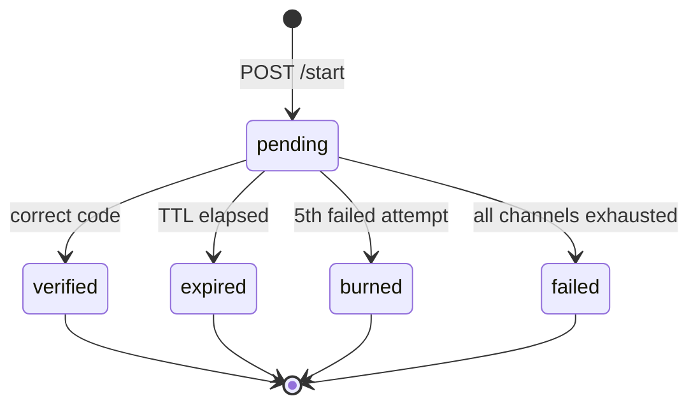

# otp-router

A provider-independent OTP verification router with automatic cross-channel fallback.

An integrating application calls two REST endpoints — `POST /v1/verification/start`,
`POST /v1/verification/check`. Underneath, the router picks the channel most likely to
actually get a code into the user's hands (not just delivered — verified), falls back to
another channel automatically when it doesn't, and learns per-number which channel works
from every attempt it makes. It sits above providers rather than being one: WhatsApp
direct to Meta at Meta's rate, Indian SMS through a domestic provider, international SMS
through a global provider, all behind one contract that never changes for the integrator.

What's differentiated from "WhatsApp-first with SMS fallback" (Twilio Verify already does
that): outcome-scored routing rather than an if-else chain, a decision log that explains
every skip rather than a black box, and a routing policy an account can edit through the
API with no deploy. See `PROJECT.md` for the full framing, `ARCHITECTURE.md` for system
structure, and `REQUIREMENTS.md` for what's actually tested.

## Architecture

```
                    ┌─────────────────────────────────────────┐
   integrator ─────▶│  apps/api  (Fastify)                    │
   POST /start      │  auth → validate → rate limit → route   │
   POST /check      │  → persist → enqueue → 202              │
                    └──────────────┬──────────────────────────┘
                                   │ enqueue
                          ┌────────▼────────┐
                          │  Redis / BullMQ │
                          └────────┬────────┘
                                   │ consume
                    ┌──────────────▼──────────────────────────┐
                    │  apps/worker                            │
                    │  delivery · fallback-timer ·            │
                    │  webhook-ingest · score-recompute       │
                    └──────┬───────────────────────┬──────────┘
                           │ send                  │ read/write
                    ┌──────▼───────┐        ┌──────▼──────┐
                    │  providers   │        │  Postgres   │
                    │  meta·twilio·│        └─────────────┘
                    │  simulated   │
                    └──────▲───────┘
                           │ status webhooks
                    ┌──────┴──────────────────────┐
                    │  apps/api /webhooks/:prov   │
                    │  verify sig → dedupe → 200  │
                    └─────────────────────────────┘
```

Three processes: **api**, **worker**, and the **dashboard** static bundle. Postgres and
Redis are managed services. The API never calls a provider synchronously — that single
rule is what makes the sub-100ms `/start` response (`R1.1.5`) achievable and testable
(full diagram and package boundaries: `ARCHITECTURE.md` §1–2).

## Fallback timeout reasoning

Every channel in a verification's chain gets a fixed timeout, scheduled the moment that
channel's send is confirmed (`R4.2` — at send time, not at `/start` time, since there's
nothing to time out until a send has actually happened):

| Channel  | Timeout |
| -------- | ------- |
| WhatsApp | 20s     |
| SMS      | 30s     |

**Why these numbers, not something else.** Waiting for a WhatsApp read receipt means
waiting forever — plenty of people leave a chat unread for hours. So the timeout has to
be judged against _when the user acts_, not when they _see_ the message, and most users
who are going to enter a code at all do it within about 15 seconds of it arriving.

That gives a window: below roughly 15s, the fallback fires while a normal, attentive
user is still mid-read — every one of those verifications now gets sent twice, on two
channels, and pays for both. Above roughly 30s, a user who hasn't acted by then has
usually already given up and closed the tab; firing a fallback at that point buys
nothing but cost. 20–30s is the balance point: late enough that a normal user's
in-progress action isn't second-guessed, early enough that a genuinely stuck delivery
gets a second channel before the user abandons the flow. SMS gets the longer end of that
window because carrier-side SMS latency is itself more variable than a WhatsApp Cloud
API send, so a SMS-is-the-fallback path needs more slack before its own timer would fire
in turn.

These are fixed constants (`packages/core/src/fallback/channel-chain.ts`,
`CHANNEL_TIMEOUT_MS`) applied identically to every account. `R4.5` calls for the value to
come from each account's routing policy instead; until that lands, every account gets the
same reasoning applied to it, which is at least a defensible default rather than an
arbitrary one.

**What actually enforces this, not just the number.** The timeout value is only half the
story — the other half is that firing it must be safe to get wrong twice:

- **The fallback timer is not the only way a channel resolves.** A `delivered` or
  `delivery-failed` webhook can resolve the same attempt first. Both paths — the webhook
  processor and the timer processor — write through the same atomic conditional UPDATE
  (`WHERE status = 'sent'`), so whichever reaches Postgres first wins the row, and the
  other one's UPDATE matches zero rows. That's the entire mechanism behind "a timer
  firing against a terminal verification is a no-op returning success, not an error"
  (`R4.3`/I9) — there's no separate cancellation state to get out of sync, just one
  guard that every writer already goes through.
- **Cancellation on success is best-effort, deliberately.** When `/check` succeeds, the
  API tries to remove every pending fallback-timer job for that verification
  (`queue.remove(jobId)`). If that removal is missed — a race, a crash, whatever — the
  timer still fires later, hits the same conditional UPDATE, finds the attempt already
  resolved, and no-ops. The correctness guarantee never depends on the cancellation
  actually landing.
- **The code is never regenerated across the chain (`R2.3`).** Every channel in the
  chain sends the exact same code, decrypted from `verifications.code_encrypted`
  (AES-256-GCM, distinct key from every other secret in the system) at the moment a
  fallback advances. This is what makes "late delivery after fallback fired still
  verifies" (T5) true by construction: `/check` only ever looks at the verification row,
  never at which channel's delivery attempt is in what state.

## State machine

Committed to `docs/state-machine.md` before any lifecycle code was written — every
ambiguity resolved on paper first.



`pending` is the only non-terminal state. Every transition is a single atomic
conditional `UPDATE ... WHERE status = 'pending'`, checked by affected row count — zero
rows means someone else already won the race, and the response is the current state,
never a retry or an error. A late event (a delayed webhook, a fallback timer firing
after success) arriving against a terminal verification is a no-op that returns `200`
(I9). Full rules and rationale: `docs/state-machine.md`.

## Provider contract and webhooks

Scope is reduced per `PROJECT.md`'s platform constraints: a test WABA cannot create the
authentication templates a real OTP send needs, so `MetaProvider` is written against the
real Cloud API contract and proven with a live `hello_world` send, while
`SimulatedProvider` remains the primary delivery path (`R5.3`). Twilio, authentication
templates, and production WABA setup are out of scope.

**Signature verification runs before any parsing or database work.**
`POST /v1/webhooks/meta` verifies `X-Hub-Signature-256` inside a Fastify content-type
parser scoped to just that route — it runs on the raw request bytes before Fastify's
JSON parser, Zod validation, or the route handler ever see the body. An invalid
signature calls back with an error carrying `statusCode: 401` and the request never
reaches the handler, the ingest queue, or Postgres (T11). Ordering is the actual
security property here, not just the presence of an HMAC check: verifying a signature
_after_ parsing means an attacker's malformed-but-unsigned JSON has already been
deserialized by the time it is rejected.

**Dedupe is a database unique constraint, not application bookkeeping.**
`webhook_events` is keyed on `(provider, provider_message_id)` alone (not event type) —
the first event a message receives is the one stored and acted on; any later event for
that same message, regardless of type, is a duplicate at the DB level (`R6.2`). A late
`delivered` arriving after a `failed` already resolved the attempt (`R4.8`) is the
canonical case this covers.

**Cost is frozen onto the attempt at send time, not looked up later (`G8`).**
`provider_rates` holds Meta's WhatsApp authentication rate card — ₹0.115 India domestic,
₹2.00 international (midpoint of the ₹1.75–2.50 band), effective 1 July 2026 — plus
representative SMS placeholders. `cost_micros_at_send` is written once, at send time,
so a later rate-card update never rewrites a historical attempt's cost. Seed it with
`pnpm --filter @otp-router/api seed:rates`.

**Local webhook delivery.** Meta needs a public HTTPS URL to call back. Run:

```
cloudflared tunnel --url http://localhost:3000
```

and register the printed `https://*.trycloudflare.com/v1/webhooks/meta` URL (plus
`META_WEBHOOK_VERIFY_TOKEN`) in the Meta app dashboard's webhook subscription.

**Live proof.** With `META_PHONE_NUMBER_ID`, `META_ACCESS_TOKEN`, and
`META_APP_SECRET` set, `MetaProvider` sends a real `hello_world` template — the
demonstration that the adapter talks to the actual Cloud API, not just its documented
shape.

## Simulation results

`pnpm simulate --scenario=india-mixed --seed=42` drives the **real** routing engine
(`R9.2`) through a seeded synthetic population and virtual clock — no wall-clock
sleeping, no reimplemented routing logic. `--ab` compares outcome-scored routing against
a fixed, non-adaptive channel order on identical traffic. Named presets: `india-mixed`,
`whatsapp-degraded`, `cold-start`; other scenario files under
`packages/simulator/scenarios/` (e.g. `international.yaml`) run by path:
`--scenario=packages/simulator/scenarios/international.yaml`.

**Method.** All numbers below are from `pnpm simulate --scenario=india-mixed --seed=42
--ab [--fixed-chain=<chain>]`, 10,000 simulated verifications, reproducible with that
exact command and seed. Cost is `provider_rates` INR at send time (`G8`); "verified"
means a correct `/check` within TTL, not a delivery webhook (`G1`).

| Metric (india-mixed, seed 42) | Outcome-scored | Fixed whatsapp→sms | Fixed sms-only |
| ----------------------------- | -------------: | -----------------: | -------------: |
| Verification rate             |         93.34% |             92.94% |         88.73% |
| Fallback rate                 |         11.20% |             38.46% |          0.00% |
| p50 time-to-verify            |        7,996ms |            9,289ms |        7,688ms |
| p95 time-to-verify            |       27,539ms |           37,234ms |       23,528ms |
| Cost per verified (₹)         |         0.1708 |             0.1808 |         0.1658 |

Read against the fixed WhatsApp-first chain, outcome-scored routing is **~6% cheaper**
per successful verification and has a **27pp lower fallback rate**, at effectively the
same verification rate (**-0.4pp**, a wash). **That ~6% figure is India-domestic-only** —
it comes from `india-mixed` traffic priced against `provider_rates`' domestic rate card
(₹0.115 WhatsApp vs ₹0.15 SMS) and does not generalize to international corridors, where
the rate ratio between channels is different (`PROJECT.md`'s ₹1.75–2.50 international
WhatsApp band vs a separate SMS rate) and the cost comparison would need its own run to
state, not an assumption that the domestic direction holds. Read against SMS-only,
outcome-scored routing is **4.6pp more successful** but **~3% more expensive** per
success — it spends more because it tries the (here, cheaper) WhatsApp channel first and
sometimes pays for a wasted attempt before falling back, but that spend buys more
completed verifications.

**Model limitation: SMS has no reachability gate.** The synthetic population
(`packages/simulator/src/population.ts`) models WhatsApp reachability explicitly
(`whatsappReachableShare`) but treats SMS as reaching 100% of numbers — the reduced-scope
assumption this project makes about SMS (`PROJECT.md`). That is why routing order barely
moves verification rate against the fixed WhatsApp-first chain above: in this model, SMS
as a fallback essentially never fails to reach someone once tried, so there is no
scenario in which routing order determines whether a verification succeeds at all, only
how fast and how expensively it does. **The cost finding above is conditional on that
assumption**: under this model, pure verification-rate optimization would shift traffic
toward SMS even though it is the more expensive channel here, purely because SMS never
fails to reach a number — a real SMS failure mode (carrier filtering, DND registry
rejection, DLT template mismatches) would very likely make routing order affect
verification rate too, not just cost and speed. That mechanism doesn't exist in this
simulator today; the fix is adding it to the model, not tuning scenario parameters to
manufacture a bigger delta on the model as it stands.

## SDK

`packages/sdk` is a typed client over the two integrator-facing endpoints (`G9`):

```ts
import { OtpRouterClient } from "@otp-router/sdk";

const client = new OtpRouterClient({
  apiKey: "<YOUR_API_KEY>",
  baseUrl: "https://<your-api-domain>",
});

// Idempotency-Key is auto-generated with crypto.randomUUID() when omitted (R1.1.6) —
// a retried network call replays the original send instead of queuing a second one.
const { verification_id } = await client.start({
  phone_number: "+<country-code><subscriber-number>",
});

const result = await client.check({ verification_id, code: "<code-from-user>" });
// or poll instead of prompting the user for a code synchronously:
const final = await client.waitForResult(verification_id, {
  intervalMs: 2000,
  timeoutMs: 60_000,
});
```

## Out of scope

| Excluded                                                    | Reason                                                                                                                                                                                                                                                                                                |
| ----------------------------------------------------------- | ----------------------------------------------------------------------------------------------------------------------------------------------------------------------------------------------------------------------------------------------------------------------------------------------------- |
| **Ads or promotional content in messages**                  | Structurally impossible. WhatsApp authentication templates use a preset format with no URLs, media, or emojis, and only authentication templates may carry a passcode. Mixing promotional content risks reclassification of every template on the account. Indian SMS is blocked equivalently by DLT. |
| Voice OTP                                                   | A whole telephony surface for one more chart bar                                                                                                                                                                                                                                                      |
| Push channel                                                | Requires per-integrator mobile SDK integration                                                                                                                                                                                                                                                        |
| Email channel                                               | Least interesting adapter, deepest deliverability rabbit hole                                                                                                                                                                                                                                         |
| Billing / payments                                          | Track cost, don't collect money                                                                                                                                                                                                                                                                       |
| Template management UI                                      | Meta's console does this                                                                                                                                                                                                                                                                              |
| Full read-model dashboard                                   | The single-verification trace view is built (the screen that demonstrates the system); Overview/Cost/Failures/Providers would need a materialised view (`R10.1`) that doesn't exist yet, so those nav destinations were removed rather than left as dead links                                        |
| Multi-region                                                | One region                                                                                                                                                                                                                                                                                            |
| Magic links / passkeys                                      | Different product                                                                                                                                                                                                                                                                                     |
| Any LLM anywhere                                            | Nothing here needs one; adding one weakens the project                                                                                                                                                                                                                                                |
| Email verification                                          | Out of the onboarding scope; signup and login work without it. Also why Google account linking is never automatic — see below                                                                                                                                                                         |
| Password reset                                              | No email sending exists yet to deliver a reset link to                                                                                                                                                                                                                                                |
| Team members / multiple users per account                   | One account, one owner. The schema (`accounts` ↔ `api_keys`) already supports many keys per account; many _people_ per account is a different feature                                                                                                                                                 |
| Plan tiers                                                  | Nothing to gate — every self-serve account behaves identically                                                                                                                                                                                                                                        |
| Linking a Google identity onto an existing password account | Deliberately excluded, not merely deferred — see "Self-serve onboarding" below for why                                                                                                                                                                                                                |

## Self-serve onboarding

A user can sign up, log in, and manage API keys entirely from the dashboard — no
terminal, no `psql` insert. Two credential types, kept deliberately disjoint:

- **API keys** (`sk_test_…` / `sk_live_…`) — for servers. Authenticate
  `/v1/verification/*` and every other server-to-server route. Argon2-hashed, a
  non-secret prefix identifies the row.
- **Sessions** (`sid` cookie) — for humans in the dashboard's browser tab. httpOnly,
  `SameSite=Lax`, 8h TTL. Authenticate `/v1/keys` and the dashboard's trace route.

Neither substitutes for the other: a session can't call `/v1/verification/start`, and
an API key can't call `/v1/keys` — enforced by two separate auth hooks on two disjoint
route sets, not one hook that trusts a shared branch.

**The 30-second revocation lag.** The API-key auth cache (`api-key-auth.ts`) caches a
verified key for 30s so argon2 — deliberately slow — isn't paid on every request.
`DELETE /v1/keys/:id` evicts the key from the _revoking_ instance's cache immediately,
but on a multi-instance deployment another instance can still honour it for up to 30s.
The keys page states that bound next to the revoke button rather than leaving it as a
surprise.

**Sign in with Google.** Authorization code flow with PKCE; the client secret is a
server-side POST field during the token exchange and never reaches the browser. The
`state` parameter is validated against a value stored in a short-lived cookie set at
redirect time — a callback with a missing or mismatched `state` is rejected before any
token exchange happens. Identity comes solely from an authenticated call to Google's
userinfo endpoint using an access token the server mints itself; no externally-supplied
`id_token` is read or trusted anywhere. Redirect URIs are read from `DASHBOARD_ORIGIN`
(config), never hardcoded, since local and deployed origins differ.

**Account linking — never automatic.** Signing up with email+password and later
signing in with Google using the same address does **not** merge the two. Google's
`email_verified: true` only means Google controls that mailbox right now; it says
nothing about whether whoever registered the email _in this system_, earlier, with a
password, is the same person. Auto-linking on a matching email is an account-takeover
path: an attacker pre-registers the victim's email with a password, the victim later
signs in with Google, and if that merges into the attacker's already-known-password
account, `email_verified: true` was satisfied the entire time and didn't stop it. So: a
matching email is always a `409 email_already_registered`, on both signup and the Google
callback. Linking an existing session to a Google identity (or vice versa) is a real
feature — it just requires the linking request to come from _inside_ an authenticated
session, where "this is the same person" is actually established. Not built.

## Platform constraints — why WhatsApp and SMS are simulated

**Authentication templates cannot be created on a test WABA.** Meta gates template
creation behind production setup: a registered business, business verification with
supporting documents, a dedicated phone number, and a payment method. Consequence:
WhatsApp is a **simulated channel** for every demo and every simulation run.
`MetaProvider` is still written against the real Cloud API contract (signature
verification, webhook parsing, send shape), and a live `hello_world` send — the one
template a test WABA can send — demonstrates that the integration talks to Meta's API
rather than only to its documented shape.

Twilio trial accounts (30-day expiry, template-only sending) and TRAI DLT registration
for real Indian SMS have equivalent prerequisites — a registered business entity and
approved sender headers and templates — so SMS also runs through `SimulatedProvider`.
None of this touches the parts of the project that are the actual point: routing,
fallback, race handling, and the simulation harness are exercised against real Postgres,
real Redis, and the real routing engine throughout.

## Running it locally, from a fresh clone

One sequence, in order, verified against a genuinely empty database (`docker compose
down -v` first to confirm it from scratch after a previous run):

```
cp .env.example .env    # fill in the pepper/key values (see comments in the file)

docker compose up -d postgres redis
pnpm install

pnpm --filter @otp-router/db db:migrate      # applies packages/db/migrations
pnpm --filter @otp-router/api seed           # prints a dashboard login AND an API key — save both
pnpm --filter @otp-router/api seed:rates     # provider_rates, needed for cost_micros_at_send

pnpm --filter @otp-router/api dev            # :3000
pnpm --filter @otp-router/worker dev         # :3001 — Bull Board + the outbox below
pnpm --filter @otp-router/dashboard dev      # :5173
```

(`pnpm dev` from the repo root runs api+worker together via `--parallel`, which is fine
when each one's own terminal output isn't needed separately; the dashboard still needs
its own `pnpm --filter @otp-router/dashboard dev` either way.)

Every entry point — `dev` and `start` for both servers, plus `seed`, `seed:rates`,
`db:migrate`, and `send:hello-world` — passes `--env-file-if-exists=../../.env` to
`tsx`. Locally that reads config from the same root `.env`, so no script expects the
shell to have exported everything already. In a deployed container there is no `.env`
(`.dockerignore` excludes it) and the platform injects real environment variables
instead; `-if-exists` makes the missing file a no-op rather than a boot failure, which is
why `start` carries the same flag as `dev` rather than being the one entry point without
it.

Requires Node >= 22.9 (`--env-file-if-exists`), which `engines` pins. A real environment
variable always wins over a `.env` entry, so a stray file cannot shadow injected config.

### Manual demo, without a real WhatsApp or SMS account

`SimulatedProvider` never lets the API or dashboard see a plaintext code (`I4`) — the
server hashes and encrypts it immediately and never logs it. So the question "how do I
see the code that was 'sent', to actually type it into `/check`" needs its own answer,
the same way provider sandboxes give a way to inspect an outbound test message: the
worker's dev-only Fastify instance (`apps/worker/src/bull-board.ts`, only constructed
when `NODE_ENV=development` — the exact same gate as Bull Board, never present in a
production build) exposes

```
GET http://localhost:3001/dev/outbox?phone_number=%2B15551234567
```

returning every `{ phoneNumber, code, channel, providerMessageId }` `SimulatedProvider`
has actually sent in this process, in memory only. It's an HTTP response body, not a log
line — the code never appears in `pino` output anywhere (`R7.2`'s audit covers exactly
this).

> The examples below use `+15551234567` as a stand-in. Any valid E.164 number works:
> `SimulatedProvider` never contacts a real device, so no number in these commands ever
> receives a message. In URLs the leading `+` must be percent-encoded as `%2B`.

**Straight-through demo (WhatsApp succeeds first try):**

```
curl -X POST http://localhost:3000/v1/verification/start \
  -H "Authorization: Bearer <key from seed>" \
  -H "Content-Type: application/json" \
  -d '{"phone_number":"+15551234567"}'
# → { "verification_id": "ver_...", "channel_attempted": "whatsapp", ... }

curl "http://localhost:3001/dev/outbox?phone_number=%2B15551234567"
# → [{ "phoneNumber": "+15551234567", "code": "<6-digit-code>", "channel": "whatsapp",
#      "providerMessageId": "sim_..." }]

curl -X POST http://localhost:3000/v1/verification/check \
  -H "Authorization: Bearer <key from seed>" \
  -H "Content-Type: application/json" \
  -d '{"verification_id":"ver_...","code":"<6-digit-code>"}'
# → { "status": "verified", ... }
```

**Fallback demo (WhatsApp times out, SMS delivers, then the code verifies).** Left to
itself, `SimulatedProvider` only ever sends — it never emits a delivery webhook the way
a real Meta or Twilio callback would, so a channel it sent on will just sit until its
fallback timer fires (20s for WhatsApp, 30s for SMS) and eventually the whole chain is
exhausted (`failed`). To make a channel actually _deliver_ instead of timing out, call
`POST /v1/webhooks/simulated` directly — the same endpoint a real provider's webhook
would hit — using the `providerMessageId` the outbox just returned for that attempt:

```
curl -X POST http://localhost:3000/v1/verification/start \
  -H "Authorization: Bearer <key from seed>" -H "Content-Type: application/json" \
  -d '{"phone_number":"+15551234567"}'
# → { "verification_id": "ver_...", "channel_attempted": "whatsapp", ... }

# Wait ~20s for the WhatsApp fallback timer to fire (do nothing — no webhook for this one).
```

Then read the outbox and post the SMS attempt's `delivered` webhook **in one shot** —
not as two commands typed separately. `POST /v1/webhooks/simulated` returning
`{"accepted":true}` means the event was enqueued onto `webhookIngestQueue`, not that the
conditional `UPDATE` has run yet (`R6.4`: verify → dedupe → **200 fast**, process on the
queue after). That gap is normal and correct — it's the same "respond fast, do the real
work async" shape as every other webhook path in this project — but it means the time
between "the `providerMessageId` is available" and "the webhook is actually applied in
Postgres" is real time, not zero. Splitting outbox-read and webhook-post into two
separate manual commands adds exactly the kind of human latency — reading output,
copy-pasting an ID, retyping a second curl — that can burn through the 20s WhatsApp /
30s SMS window before the webhook ever reaches Postgres, at which point the fallback
timer wins the row first and legitimately advances the chain. One combined command
removes that gap:

**bash** (`jq` required):

```bash
MSG_ID=$(curl -s "http://localhost:3001/dev/outbox?phone_number=%2B15551234567" \
  | jq -r '[.[] | select(.channel=="sms")] | last | .providerMessageId')
curl -s -X POST http://localhost:3000/v1/webhooks/simulated \
  -H "Content-Type: application/json" \
  -d "{\"provider_message_id\":\"$MSG_ID\",\"event_type\":\"delivered\"}"
# → { "accepted": true } — the SMS attempt is now "delivered", the verification is
#   still "pending" (delivered ≠ verified — G1), exactly the state to demo /check from.
```

**PowerShell:**

```powershell
$msg = (Invoke-RestMethod "http://localhost:3001/dev/outbox?phone_number=%2B15551234567") |
  Where-Object { $_.channel -eq "sms" } | Select-Object -Last 1
Invoke-RestMethod -Method Post "http://localhost:3000/v1/webhooks/simulated" `
  -ContentType "application/json" `
  -Body (@{ provider_message_id = $msg.providerMessageId; event_type = "delivered" } | ConvertTo-Json)
```

Both forms narrow the outbox to one row before reading `providerMessageId`, and that
part is not optional: `/dev/outbox` returns every message this worker process has sent
since it started, across every verification, so on the unfiltered list
`.providerMessageId` is a whole array — which PowerShell string-interpolates into one
space-joined value. The route only requires a non-empty string (`min(1)`), so that
reaches the server as a plausible-looking ID, gets `{"accepted":true}` like any other
event (`R6.4`), and then matches no delivery attempt: the worker logs `webhook event for
unknown provider_message_id — no-op` and changes nothing (`R6.5`). That is the intended
behaviour, but from the client side it is indistinguishable from a webhook that worked,
so check the worker log if a channel that was "delivered" still times out.

```
curl -X POST http://localhost:3000/v1/verification/check \
  -H "Authorization: Bearer <key from seed>" -H "Content-Type: application/json" \
  -d '{"verification_id":"ver_...","code":"<6-digit-code>"}'
# → { "status": "verified", ... }
```

No env var or scenario config turns this on — `POST /v1/webhooks/simulated`
(`apps/api/src/routes/webhooks.ts`) is always registered; the manual demo just calls it
directly instead of a real provider calling it. `event_type: "failed"` works the same way
to demo a hard provider error advancing the chain instead of a timeout.

Open `http://localhost:5173/trace/<verification_id>` in the dashboard to see the same
verification's routing decision, attempts, and webhook events end to end — this is
where the WhatsApp `timed_out` / SMS `delivered` split from the fallback demo above is
easiest to inspect.

### Sign in with Google (optional)

The dashboard works entirely without this — email + password is the default path.
"Sign in with Google" only appears once `GOOGLE_CLIENT_ID` and `GOOGLE_CLIENT_SECRET`
are both set (same conditional-registration pattern as the Meta webhook route).

**Google Cloud Console, one-time setup:**

1. [console.cloud.google.com](https://console.cloud.google.com) → new project.
2. **APIs & Services → OAuth consent screen** → User type **External** → fill in an
   app name and a designated developer/support email address as both contacts →
   **Save**. Scopes: `openid`, `.../auth/userinfo.email`, `.../auth/userinfo.profile` —
   all non-sensitive, no Google review needed. Publishing status can stay **Testing**,
   with the Google accounts used for testing added under **Test users**.
3. **Credentials → Create credentials → OAuth client ID → Web application.**
4. **Authorized redirect URIs** — exact, byte-for-byte. These point at the dashboard's
   origin (`DASHBOARD_ORIGIN`), not the API's: the dashboard proxies `/v1/*` through to
   the API (`vite.config.ts` in dev, `nginx.conf.template` in prod), so Google's redirect
   lands on the dashboard's origin first:
   - `http://localhost:5173/v1/auth/google/callback`
   - `https://<your-dashboard-domain>/v1/auth/google/callback`

   Authorized JavaScript origins: none needed — the browser never calls Google
   directly, only the API does, server-side.

5. Copy the **Client ID** and **Client secret** into the API service's environment. The
   secret is an API-service env var only — it never becomes a `VITE_*` variable, and
   never ends up in the dashboard's build output.

## Deploy

`docker compose up -d --build` brings up all four services declared in
`docker-compose.yml` — Postgres, Redis, the API (`apps/api/Dockerfile`), and the worker
(`apps/worker/Dockerfile`) — each running its workspace's TypeScript source directly
through `tsx`, the same as `pnpm dev`, rather than maintaining a second
dist-and-rewritten-import-paths build for a set of internal services that are never
published as packages. Before the first boot against a fresh database:

```
pnpm --filter @otp-router/db db:migrate
pnpm --filter @otp-router/api seed:rates
```

`GET /health` and `GET /ready` (the latter checks live Postgres and Redis connectivity)
are what a platform's health check should point at. The dashboard (`apps/dashboard`) is
an nginx container (`apps/dashboard/Dockerfile`) built from a static Vite build; it isn't
part of `docker-compose.yml` because it's stateless and has no dependency on the other
three services being colocated.

**Environment variables:**

| Var                    | Where              | Notes                                                                                                                                           |
| ---------------------- | ------------------ | ----------------------------------------------------------------------------------------------------------------------------------------------- |
| `PASSWORD_PEPPER`      | API                | Required — boot fails without it (`R11.3`'s fail-fast behaviour). Use a distinct value per environment, generated like the other three peppers. |
| `GOOGLE_CLIENT_ID`     | API                | Optional — Google sign-in registers its routes only if this and the secret are both set.                                                        |
| `GOOGLE_CLIENT_SECRET` | API                | Optional. Server-side only — never a build-time `VITE_*` var.                                                                                   |
| `DASHBOARD_ORIGIN`     | API                | Used for CORS, and the origin the Google redirect URI is built from.                                                                            |
| `API_ORIGIN`           | Dashboard, runtime | nginx's proxy target for `/v1/*` — `nginx.conf.template`'s `envsubst` reads it at container start.                                              |
| `VITE_API_URL`         | Dashboard, build   | Set to **empty** — the dashboard calls `/v1/*` same-origin through the proxy, not an absolute API origin.                                       |

Secret values (peppers, encryption keys, provider credentials) belong in the platform's
secret store or a gitignored local `.env`, never in the repository. `.env.example` lists
every required key with empty values.

The dashboard and API being same-origin (via the proxy) is what lets the session cookie
stay `SameSite=Lax` instead of the weaker `SameSite=None; Secure` that a genuine
cross-origin setup would need.

## Known gaps

**How a verified verification gets attributed to a channel is a convention, not a
measurement.** Every channel in a chain sends the same code (`R2.3`) and nothing observes
which message the user actually read, so `channel_verified` — and therefore
`channel_scores`' per-channel verification rate, `G1`'s metric — is decided by rule: the
last channel that delivered, falling back to the last one sent, or `null` when nothing was
sent. The rule, why it is last-delivered rather than first-attempt, the residual bias it
cannot remove, and the constant-`"whatsapp"` bug that made this metric meaningless for a
long stretch of development are all documented in
`docs/findings/channel-attribution.md`.

**A `failed` verification carries no reason code.** `R1.2.6`'s `/check` outcome
vocabulary (`verified`, `invalid_code`, `expired`, `already_verified`,
`attempts_exceeded`, `not_found`, `failed`) covers why a `/check` _call_ was rejected,
but a verification that reaches the terminal `failed` state via chain exhaustion (every
channel timed out or hard-errored, with no `/check` ever attempted) exposes the same
bare `"status": "failed"` as a verification that failed for some other reason — a caller
can't distinguish "every channel tried couldn't reach this number" from other
terminal-failure paths, or get a per-channel breakdown, from `GET /verification/:id`
alone (that detail exists in `GET /verification/:id/trace`'s `attempts` array, but the
trace endpoint is a debugging/dashboard view, not the integration-facing contract).
Not built — noted as a gap rather than adding a reason-code field speculatively.

**Not production infrastructure.** This project has not been operated under real
traffic, has no on-call or incident process, and — per the platform constraints above —
has never delivered a production OTP to a real recipient. The measured results come from
a deterministic simulation, not from production telemetry.
