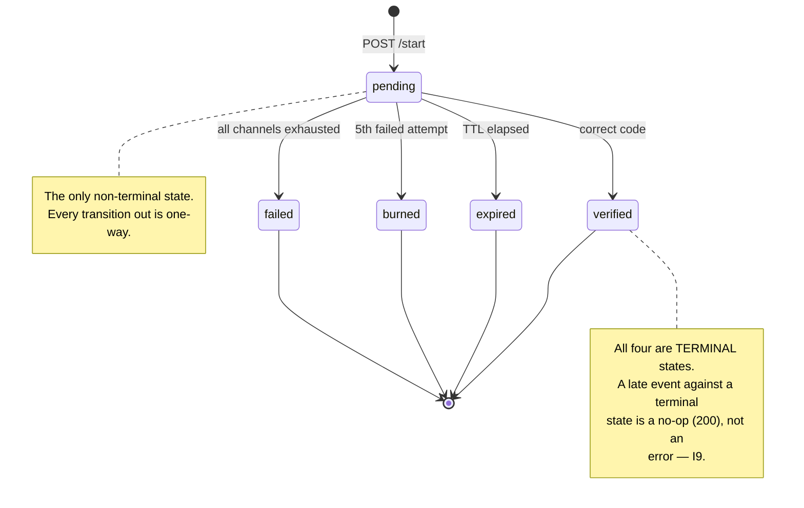

# Verification state machine

Source of truth: ARCHITECTURE.md §3. Committed before lifecycle code per PLAN.md Phase 0,
item 7 — every ambiguity resolved on paper first.

## Rules (non-negotiable — see AGENTS.md §3, I2 and I9)

1. `pending` is the only non-terminal state.
2. Every transition is a single atomic conditional `UPDATE ... WHERE status = 'pending'`,
   checked by affected row count. Zero rows means someone else already won the race — return
   the current state, do not throw or retry the write.
3. A late event (a delayed webhook, a fallback timer firing after success) arriving against a
   terminal verification is a no-op that returns `200`, never an error.
4. Delivery attempts have their own independent lifecycle
   (`queued → sent → delivered | failed | timed_out`). A verification can be `verified` while
   an attempt row is still `sent` — see the fallback sequence in ARCHITECTURE.md §4.

## Why this shape

One code is shared across every channel (R2.3), so `verified` can be reached regardless of
which channel actually delivered it, and regardless of arrival order. This is what makes the
race in ARCHITECTURE.md §4 (WhatsApp delivers after SMS fallback already fired) resolve
correctly: whichever channel got the code to the user first wins, and the other becomes a
no-op against a terminal state.
